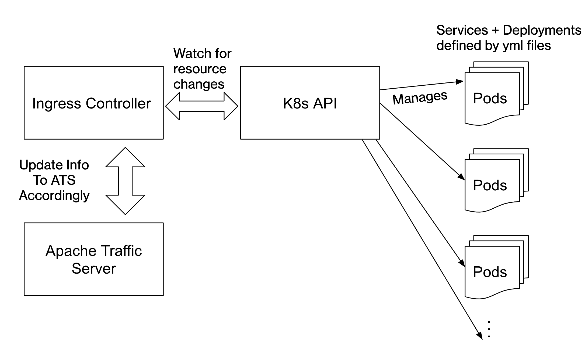
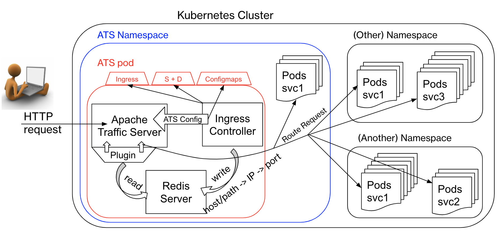

<!--
    Licensed to the Apache Software Foundation (ASF) under one
    or more contributor license agreements.  See the NOTICE file
    distributed with this work for additional information
    regarding copyright ownership.  The ASF licenses this file
    to you under the Apache License, Version 2.0 (the
    "License"); you may not use this file except in compliance
    with the License.  You may obtain a copy of the License at

      http://www.apache.org/licenses/LICENSE-2.0

    Unless required by applicable law or agreed to in writing,
    software distributed under the License is distributed on an
    "AS IS" BASIS, WITHOUT WARRANTIES OR CONDITIONS OF ANY
    KIND, either express or implied.  See the License for the
    specific language governing permissions and limitations
    under the License.
-->

ATS Kubernetes Ingress Controller
=================================

## Prerequisites
It is assumed that you understand conceptually, [docker containers](https://www.docker.com/resources/what-container), [kubernetes](https://kubernetes.io/), and [proxy servers](https://en.wikipedia.org/wiki/Proxy_server)

*Throughout ALL documentations, this project is referred to as "**ingress controller**" or "**the controller**"

## Contents
- [ATS Kubernetes Ingress Controller](#ats-kubernetes-ingress-controller)
  - [Prerequisites](#prerequisites)
  - [Contents](#contents)
  - [Abstract](#abstract)
  - [What is Ingress Controller?](#what-is-ingress-controller)
  - [Versions](#versions)
  - [How to use](#how-to-use)
    - [Required Software](#required-software)
    - [Download project](#download-project)
    - [Example Walkthrough](#example-walkthrough)
      - [Proxy](#proxy)
      - [ConfigMap](#configmap)
      - [Snippet](#snippet)
      - [Ingress Class](#ingressclass)
  - [Development](#development)
    - [Develop with Go-Lang in Linux](#develop-with-go-lang-in-linux)
    - [Compilation](#compilation)
    - [Text-Editor](#text-editor)
  - [Documentation](#documentation)

## Abstract
[Apache Traffic Server (ATS)](https://trafficserver.apache.org/) is a high performance, open-source, caching proxy server that is scalable and configurable. This project integrates ATS as the ingress resource to a [Kubernetes(K8s)](https://kubernetes.io/) cluster, then acts as the ingress resource's custom controller. 





From high-level, the ingress controller talks to K8s' API and sets up `watchers` on specific resources that are interesting to ATS. Then, the controller _controls_ ATS by either (1) relay the information from K8s API to ATS, or (2) configure ATS directly.





## What is Ingress Controller?
As defined by [kubernetes/ingress-nginx](https://github.com/kubernetes/ingress-nginx#what-is-an-ingress-controller):
>An Ingress Controller is a daemon, deployed as a Kubernetes Pod, that watches the apiserver's `/ingresses` endpoint for updates to the [Ingress resource](https://kubernetes.io/docs/concepts/services-networking/ingress/). Its job is to satisfy requests for Ingresses.

## Versions 
- Alpine 3.11
- Apache Traffic Server 8.0.6
- LuaJIT 2.0.4
- Lua 5.1.4
- Go 1.12.8
- Other Packages
  - luasocket 3.0rc1
  - redis-lua 2.0.4

## How to use

### Required Software
- Docker
- Kubernetes

To install Docker, visit its [official page](https://docs.docker.com/) and install the correct version for your system.

The easiest way to get Kubernetes on a Mac is through Docker. Launch Docker on your machine and go to `Preferences -> Kubernetes`, Click `Enable Kubernetes` then `Apply`. Kubernetes will be enabled and starting.

### Download project 
If you are cloning this project for development, visit [Setting up Go-Lang](#setting-up-go-lang) for detailed guide on how to develop projects in Go. 

For other purposes, you can use `git clone` or directly download repository to your computer.

### Example Walkthrough
Once you have cloned the project repo and started Docker and Kubernetes, in the terminal:
1. `$ cd trafficserver-ingress-controller`
2. `$ docker build -t ats_alpine .` 
     - wait for Docker finish building the image
3. `$ docker build -t node-app-1 k8s/backend/node-app-1/`    
     - wait for Docker finish building the image
4. `$ docker build -t node-app-2 k8s/backend/node-app-2/`
     - wait for Docker finish building the image

- At this point, we have created necessary images for our example. Let's talk about what each step does:
  - Step 2 builds an image to create a Docker container that will contain the Apache Traffic Server (ATS) itself, the kubernetes ingress controller, along with other software required for the controller to do its job.
  - Steps 3 and 4 builds 2 images that will serve as backends to [kubernetes services](https://kubernetes.io/docs/concepts/services-networking/service/) which we will shortly create

5. `$ kubectl create namespace trafficserver-test`
    - Create a namespace for ATS pod
6. `$ openssl req -x509 -sha256 -nodes -days 365 -newkey rsa:2048 -keyout tls.key -out tls.crt -subj "/CN=atssvc/O=atssvc"`
    - Create a self-signed certificate
7. `$ kubectl create secret tls tls-secret --key tls.key --cert tls.crt -n trafficserver-test --dry-run=client -o yaml | kubectl apply -f -`
    - Create a secret in the namespace just created
5. `$ kubectl apply -f k8s/traffic-server/`
    -  will define a new [kubernetes namespace](https://kubernetes.io/docs/concepts/overview/working-with-objects/namespaces/) named `trafficserver-test` and deploy a single ATS pod to said namespace. The ATS pod is also where the ingress controller lives. Additionally, this will expose your local machine's port `30000` to the outside world.

#### Proxy

The following steps can be executed in any order, thus list numbers are not used.

- `$ kubectl apply -f k8s/apps/`
  - creates namespaces `trafficserver-test-2` and `trafficserver-test-3` if not already exist
  - creates kubernetes services and [deployments](https://kubernetes.io/docs/concepts/workloads/controllers/deployment/) for `appsvc1` and `appsvc2`
  - deploy 2 of each `appsvc1`, and `appsvc2` pods in `trafficserver-test-2`, totally 4 pods in said namespace.
  - similarly, deploy 2 of each `appsvc1`, and `appsvc2` pods in `trafficserver-test-3`, totally 4 pods in this namespace. We now have 8 pods in total for the 2 services we have created and deployed in the 2 namespaces.
  - in addition to the ATS pod, we have created and deployed 9 pods.

- `$ kubectl apply -f k8s/ingresses/`
  - creates namespaces `trafficserver-test-2` and `trafficserver-test-3` if not already exist
  - defines an ingress resource in both `trafficserver-test-2` and `trafficserver-test-3`
  - the ingress resource in `trafficserver-test-2` defines domain name `test.media.com` with `/app1` and `/app2` as its paths
  - both ingress resources define domain name `test.edge.com`; however, `test.edge.com/app1` is only defined in `trafficserver-test-2` and `test.edge.com/app2` is only defined in `trafficserver-test-3`
  - Addtionally, an ingress resources defines HTTPS access for `test.edge.com/app2` in namespace `trafficserver-test-3`

When both steps _above_ have executed at least once, ATS proxying will have started to work. 

In kubernetes, ingress resources are necessary to enable proxying since it is where domain names are defined. However, given _only_ domain names, ATS cannot proxy requests when it doesn't have backend(s) to handle requests. Thus, only when both service pods and ingress are defined can ATS start proxying. To see proxy in action, we can use [curl](https://linux.die.net/man/1/curl) to "fake" external requests:

1. `$ curl -vH "HOST:test.media.com" "localhost:30000/app1"`
2. `$ curl -vH "HOST:test.media.com" "localhost:30000/app2"`
3. `$ curl -vH "HOST:test.edge.com" "localhost:30000/app1"`
4. `$ curl -vH "HOST:test.edge.com" "localhost:30000/app2"`
5. `$ curl -vH "HOST:test.edge.com" -k "https://localhost:30043/app2"`

With above curl commands, outputs from number 1 and 3 should be the same; outputs from number 2 and 4 should be same. The corresponding pairs are the same because all `/app1` use the same backend service _image_, and the same goes for `/app2`. Number 5 illustrates the https version for number 4 and the result is similar. 

Expected received packet from `/app1` resembles:
```html
< HTTP/1.1 200 OK
< X-Powered-By: Express
< Accept-Ranges: bytes
< Cache-Control: public, max-age=0
< Last-Modified: Tue, 06 Aug 2019 16:31:53 GMT
< ETag: W/"be-16c67c5d0a8"
< Content-Type: text/html; charset=UTF-8
< Content-Length: 190
< Date: Mon, 19 Aug 2019 18:39:14 GMT
< Age: 1
< Connection: keep-alive
< Server: ATS/7.1.6
< 
<!DOCTYPE html>
<HTML>

<HEAD>
    <TITLE>
        Hello from app1
    </TITLE>
</HEAD>

<BODY>
    <H1>Hi</H1>
    <P>This is very minimal "hello world" HTML document.</P>
</BODY>

</HTML>
* Connection #0 to host localhost left intact
```

Expected received packet from `/app2` resembles:
```html
< HTTP/1.1 200 OK
< X-Powered-By: Express
< Accept-Ranges: bytes
< Cache-Control: public, max-age=0
< Last-Modified: Fri, 14 Jun 2019 18:18:51 GMT
< ETag: W/"bc-16b5736b2f8"
< Content-Type: text/html; charset=UTF-8
< Content-Length: 188
< Date: Mon, 19 Aug 2019 18:39:10 GMT
< Age: 0
< Connection: keep-alive
< Server: ATS/7.1.6
< 
<!DOCTYPE html>
<HTML>

<HEAD>
    <TITLE>
        A Small Hello
    </TITLE>
</HEAD>

<BODY>
    <H1>Hi</H1>
    <P>This is very minimal "hello world" HTML document.</P>
</BODY>

</HTML>
* Connection #0 to host localhost left intact
```

The curl commands demonstrate that, with the help of the ingress controller, ATS can not only resolve domain names while routing requests to various namespaces based on path, but also, is capable of handling the case where domain's paths existing across different namespaces. 

Of course there are checks in place by the ingress controller so that any path corresponding to a domain name can only be defined in one namespace, and domain names are resolved across all namespace. 

#### ConfigMap

Below is an example of configuring Apache Traffic Server [_reloadable_ configurations](https://docs.trafficserver.apache.org/en/8.0.x/admin-guide/files/records.config.en.html#reloadable) using [kubernetes configmap](https://kubernetes.io/docs/tasks/configure-pod-container/configure-pod-configmap/) resource:

- `$ kubectl apply -f k8s/configmaps/`
  - create a ConfigMap resource in `trafficserver-test` if not already exist
  - configure 3 _reloadable_ ATS configurations:
    1. `proxy.config.output.logfile.rolling_enabled: "1"`
    2. `proxy.config.output.logfile.rolling_interval_sec: "3000"`
    3. `proxy.config.restart.active_client_threshold: "0"`
  - feel free to add other reloadable configurations, and/or change the above 3 to other valid values. Checks are in place so that mistakes are tolerated.

#### Snippet

You can attach [ATS lua script](https://docs.trafficserver.apache.org/en/8.0.x/admin-guide/plugins/lua.en.html) to an ingress object and ATS will execute it for requests matching the routing rules defined in the ingress object. See an example in k8s/ingresses/ats-ingress-2.yaml 

#### Ingress Class

You can provide an environment variable called `INGRESS_CLASS` in the deployment to specify the ingress class. Only ingress object with annotation `kubernetes.io/ingress.class` with value equal to the environment variable value will be used by ATS for routing

## Development

### Develop with Go-Lang in Linux
1. Get Go-lang 1.12 from [official site](https://golang.org/dl/)
2. Add `go` command to your PATH: `export PATH=$PATH:/usr/local/go/bin`
3. Define GOPATH: `export GOPATH=$(go env GOPATH)`
4. Add Go workspace to your PATH: `export PATH=$PATH:$(go env GOPATH)/bin`
5. Define Go import Paths
   - Go's import path is different from other languages in that all import paths are _absolute paths_. Due to this reason, it is important to set up your project paths correctly
   - define the base path: `mkdir -p $GOPATH/src/github.com/<your user name>/`
6. Clone the project:
   - `cd $GOPATH/src/github.com/<your user name>/`
   - `git clone <project>`
7. As of Go 1.12 in order to have `go.mod` within Go paths, you must export: `export GO111MODULE=on` to be able to compile locally. 

*Above steps are a very short summary of [Getting Started](https://golang.org/doc/install) and [How to Write Go Code](https://golang.org/doc/code.html) from official Go-lang documentation. For more detailed info and/or assistance, it is recommended to checkout these 2 links first.

### Compilation
To compile, while in `ingress-ats/` directory: `go build -o ingress_ats main/main.go`

### Text-Editor
The repository comes with basic support for both [vscode](https://code.visualstudio.com/) and `vim`. 

If you're using `vscode`:
- `.vscode/settings.json` contains some basic settings for whitespaces and tabs
- `.vscode/extensions.json` contains a few recommended extensions for this project. It is highly recommended to install the [Go extension](https://github.com/Microsoft/vscode-go) since it contains the code lint this project used during development.

If you're using `vim`, a `vimrc` file with basic whitespace and tab configurations is also provided

