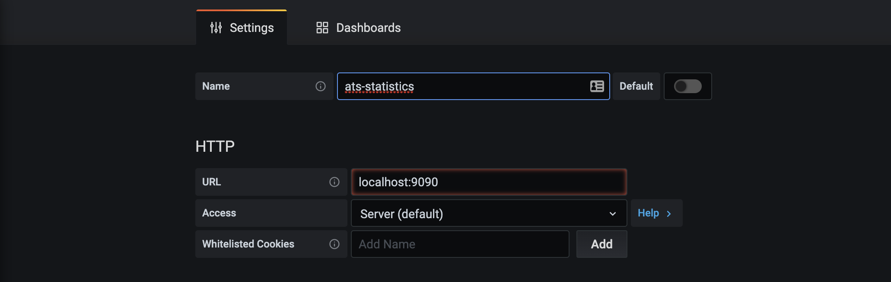
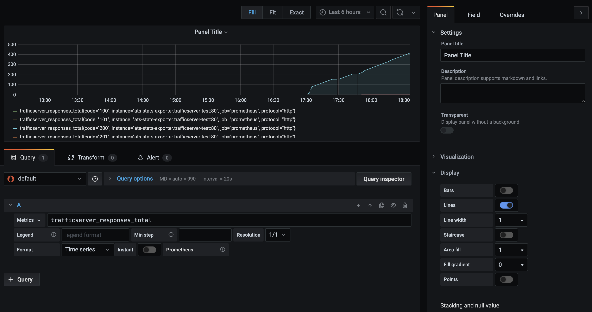

<!--
    Licensed to the Apache Software Foundation (ASF) under one
    or more contributor license agreements.  See the NOTICE file
    distributed with this work for additional information
    regarding copyright ownership.  The ASF licenses this file
    to you under the Apache License, Version 2.0 (the
    "License"); you may not use this file except in compliance
    with the License.  You may obtain a copy of the License at

      http://www.apache.org/licenses/LICENSE-2.0

    Unless required by applicable law or agreed to in writing,
    software distributed under the License is distributed on an
    "AS IS" BASIS, WITHOUT WARRANTIES OR CONDITIONS OF ANY
    KIND, either express or implied.  See the License for the
    specific language governing permissions and limitations
    under the License.
-->

## Tutorial
- [Requirements](#requirements)
- [Download project](#download-project)
- [Example Walkthrough](#example-walkthrough)
  - [Setting Up Proxy](#setting-up-proxy)
  - [Setting Up Backend Applications](#setting-up-backend-applications)
  - [Checking Results](#checking-results)
  - [ConfigMap](#configmap)
  - [Namespaces for Ingresses](#namespaces-for-ingresses)
  - [Snippet](#snippet)
  - [Ingress Class](#ingress-class)
  - [Customizing Logging and TLS](#customizing-logging-and-tls)
  - [Customizing plugins](#customizing-plugins)
- [Logging and Monitoring](#logging-and-monitoring)
  - [Fluentd](#fluentd)
  - [Prometheus and Grafana](#prometheus-and-grafana)
- [Helm Chart](#helm-chart)

### Requirements
- Docker 
- (Tested on) Kubernetes 1.22.16 (through Minikube 1.25.2)

To install Docker, visit its [official page](https://docs.docker.com/) and install the correct version for your system.

The walkthrough uses Minikube to guide you through the setup process. Visit the [official Minikube page](https://kubernetes.io/docs/tasks/tools/install-minikube/) to install Minikube. 

### Download project 
You can use `git clone` to download repository to your computer.

### Example Walkthrough

#### Setting Up Proxy

Once you have cloned the project repo and started Docker and Minikube, in the terminal:
1. `$ eval $(minikube docker-env)`
2. `$ cd trafficserver-ingress-controller`
3. `$ git submodule update --init`
4. `$ docker build -t ats-ingress .` 
5. `$ docker build -t ats-ingress-exporter k8s/images/trafficserver_exporter/` 
6. `$ docker build -t node-app-1 k8s/images/node-app-1/`    
7. `$ docker build -t node-app-2 k8s/images/node-app-2/`
8. `$ docker pull fluent/fluentd:v1.14-debian-1`

- At this point, we have created necessary images for our example:
  - Step 4 builds an image to create a Docker container that will contain the Apache Traffic Server (ATS) itself, the kubernetes ingress controller, along with other software required for the controller to do its job.
  - Step 5 builds an image for the trafficserver exporter. This exports the ATS statistics for Prometheus to read. It uses the [Stats Over HTTP Plugin](https://docs.trafficserver.apache.org/en/9.0.x/admin-guide/plugins/stats_over_http.en.html)
  - Steps 6 and 7 build 2 images that will serve as backends to [kubernetes services](https://kubernetes.io/docs/concepts/services-networking/service/) which we will shortly create
  - Step 8 builds an image for fluentd. This is for log collection.

9. `$ kubectl apply -f k8s/traffic-server/ats-ns.yaml`
10. `$ openssl req -x509 -sha256 -nodes -days 365 -newkey rsa:2048 -keyout tls.key -out tls.crt -subj "/CN=atssvc/O=atssvc"`
11. `$ kubectl create secret tls tls-secret --key tls.key --cert tls.crt -n trafficserver-test --dry-run=client -o yaml | kubectl apply -f -`
12. `$ kubectl apply -f k8s/configmaps/fluentd-configmap.yaml`
13. `$ kubectl apply -f k8s/traffic-server/`

- Now we have an ATS running inside the cluster. 
  - Step 9 creates a namespace for ATS pod.
  - Steps 10 and 11 create a self-signed SSL certificate and keep it in a secret inside the namespace above.
  - Step 12 provides the ConfigMap for configuration options for fluentd
  - Step 13 deploys a single ATS pod to said namespace. The ATS pod is also where the ingress controller lives. 

#### Setting Up Backend Applications

The following steps can be executed in any order

- `$ kubectl apply -f k8s/apps/`
  - creates namespaces `trafficserver-test-2` and `trafficserver-test-3` if not already exist
  - creates kubernetes services and [deployments](https://kubernetes.io/docs/concepts/workloads/controllers/deployment/) for `appsvc1` and `appsvc2`
  - deploy 2 of each `appsvc1`, and `appsvc2` pods in `trafficserver-test-2`, totally 4 pods in said namespace.
  - similarly, deploy 2 of each `appsvc1`, and `appsvc2` pods in `trafficserver-test-3`, totally 4 pods in this namespace. We now have 8 pods in total for the 2 services we have created and deployed in the 2 namespaces.

- `$ kubectl apply -f k8s/ingresses/`
  - creates namespaces `trafficserver-test-2` and `trafficserver-test-3` if not already exist
  - defines an ingress resource in both `trafficserver-test-2` and `trafficserver-test-3`
  - the ingress resource in `trafficserver-test-2` defines domain name `test.media.com` with `/app1` and `/app2` as its paths
  - both ingress resources define domain name `test.edge.com`; however, `test.edge.com/app1` is only defined in `trafficserver-test-2` and `test.edge.com/app2` is only defined in `trafficserver-test-3`
  - Addtionally, an ingress resources defines HTTPS access for `test.edge.com/app2` in namespace `trafficserver-test-3`

#### Checking Results

ATS proxying should have started to work. To see proxy in action, we can use [curl](https://linux.die.net/man/1/curl):

1. `$ curl -vH "HOST:test.media.com" "$(minikube ip):30080/app1"`
2. `$ curl -vH "HOST:test.media.com" "$(minikube ip):30080/app2"`
3. `$ curl -vH "HOST:test.edge.com" "$(minikube ip):30080/app1"`
4. `$ curl -vH "HOST:test.edge.com" "$(minikube ip):30080/app2"`
5. `$ curl -vH "HOST:test.edge.com" -k "https://$(minikube ip):30443/app2"`

You may have problem with minikube using docker driver as localhost (i.e. 127.0.0.1) will be used as the cluster ip. So you will need to forward the traffic designated for the port to the ports of the ATS pods inside the cluster before the above curl commands will work. Each command below needs to be run in separate terminal. 

- `$ kubectl port-forward $(kubectl -n trafficserver-test get pods -l=app="trafficserver-test" -o name) 30443:8443 -n trafficserver-test`
- `$ kubectl port-forward $(kubectl -n trafficserver-test get pods -l=app="trafficserver-test" -o name) 30080:8080 -n trafficserver-test`

#### ConfigMap

Below is an example of configuring Apache Traffic Server [_reloadable_ configurations](https://docs.trafficserver.apache.org/en/8.0.x/admin-guide/files/records.config.en.html#reloadable) using [kubernetes configmap](https://kubernetes.io/docs/tasks/configure-pod-container/configure-pod-configmap/) resource:

- `$ kubectl apply -f k8s/configmaps/ats-configmap.yaml`
  - create a ConfigMap resource in `trafficserver-test` with the annotation `"ats-configmap":"true"` if not already exist
  - configure 3 _reloadable_ ATS configurations:
    1. `proxy.config.output.logfile.rolling_enabled: "1"`
    2. `proxy.config.output.logfile.rolling_interval_sec: "3000"`
    3. `proxy.config.restart.active_client_threshold: "0"`

#### Namespaces for Ingresses

You can specifiy the list of namespaces to look for ingress object by providing an environment variable called `INGRESS_NS`. The default is `all`, which tells the controller to look for ingress objects in all namespaces. Alternatively you can provide a comma-separated list of namespaces for the controller to look for ingresses. Similarly you can specifiy a comma-separated list of namespaces to ignore while the controller is looking for ingresses by providing `INGRESS_IGNORE_NS`.

#### Snippet

You can attach [ATS lua script](https://docs.trafficserver.apache.org/en/8.0.x/admin-guide/plugins/lua.en.html) to an ingress object and ATS will execute it for requests matching the routing rules defined in the ingress object. See an example in annotation section of yaml file [here](../k8s/ingresses/ats-ingress-2.yaml) 

#### Ingress Class

You can provide an environment variable called `INGRESS_CLASS` in the deployment to specify the ingress class. See an example commented out [here](../k8s/traffic-server/ats-deployment.yaml). Only ingress object with parameter `ingressClassName` in `spec` section with value equal to the environment variable value will be used by ATS for routing

#### Customizing Logging and TLS

You can specify a different
[logging.yaml](https://docs.trafficserver.apache.org/en/8.1.x/admin-guide/files/logging.yaml.en.html) and [ssl_server_name.yaml](https://docs.trafficserver.apache.org/en/8.1.x/admin-guide/files/ssl_server_name.yaml.en.html) by providing environment variable `LOG_CONFIG_FNAME` and `SSL_SERVER_FNAME` respsectively. See an example commented out [here](../k8s/traffic-server/ats-deployment.yaml). The new contents of them can be provided through a ConfigMap and loaded to a volume mounted for the ATS container (Example [here](https://kubernetes.io/docs/concepts/storage/volumes/#configmap) ). Similarly certificates needed for the connection between ATS and origin can be provided through a Secret that loaded to a volume mounted for the ATS container as well (Example [here](https://kubernetes.io/docs/concepts/configuration/secret/#using-secrets-as-files-from-a-pod) ). To refresh these certificates we may need to override the entrypoint with our own command and add extra script to watch for changes in those secret in order to reload ATS (Example [here](../bin/tls-reload.sh) ).

#### Customizing Plugins

You can specify extra plugins for [plugin.config](https://docs.trafficserver.apache.org/en/8.1.x/admin-guide/files/plugin.config.en.html) by providing environment variable `EXTRA_PLUGIN_FNAME`. Its contents can be provided through a ConfigMap and loaded to a volume mounted for the ATS container (Example [here](https://kubernetes.io/docs/concepts/storage/volumes/#configmap) ).

#### Enabling Controller Debug Log

You can enable debug for the controller by providing environment variable `INGRESS_DEBUG`. See an example commented out [here](../k8s/traffic-server/ats-deployment.yaml).

#### Tune Resync Period of Controller

You can adjust the resync period for the controller by providing environment variable `RESYNC_PRIOD`.

### Logging and Monitoring

#### Fluentd

The above tutorial is already integrated with [Fluentd](https://docs.fluentd.org/). The configuration file used for the same can be found [here](../k8s/configmaps/fluentd-configmap.yaml)

As can be seen from the default configuration file, Fluentd reads the Apache Traffic Server access logs located at
`/opt/ats/var/log/trafficserver/squid.log` and outputs them to `stdout`. Use `kubectl logs` to check the logs

- `kubectl logs $(kubectl -n trafficserver-test get pods -l=app="trafficserver-test" -o name) -n trafficserver-test -c log-collector`

The ouput plugin for Fluentd can be changed to send the logs to any desired location supported by Fluentd including Elasticsearch, Kafka, MongoDB etc. You can read more about output plugins [here](https://docs.fluentd.org/output).

#### Prometheus and Grafana

Use the following steps to install [Prometheus](https://prometheus.io/docs/prometheus/latest/getting_started/) and [Grafana](https://grafana.com/docs/grafana/latest/) and use them to monitor the Apache Traffic Server statistics.

1. `$ kubectl apply -f k8s/prometheus/ats-stats.yaml`
  - Creates a new service which connects to the ATS pod on port 9122. This service will be used by Prometheus to read the Apache Traffic Server stats.  
2. `$ kubectl apply -f k8s/configmaps/prometheus-configmap.yaml`
  - Creates a new configmap which holds the configuration file for Prometheus. You can modify this configuration file to suit your needs. More about that can be read [here](https://prometheus.io/docs/prometheus/latest/configuration/configuration/)
3. `$ kubectl apply -f k8s/prometheus/prometheus-deployment.yaml`
  - Creates a new deployment consisting of Prometheus and Grafana. Also creates two new services to access prometheus and grafana. 
4. Open `x.x.x.x:30090` in your web browser to access Prometheus where `x.x.x.x` is the IP returned by the command: `$ minikube ip` 
5. Open `x.x.x.x:30030` in your web browser to access the Grafana dashboard where `x.x.x.x` is the IP returned by the command: `$ minikube ip`.
6. The default credentials for logging into Grafana are `admin:admin`
7. Click on `Add your first data source' and select Prometheus under the 'Time series databases category'
8. Set an appropriate name for the data source and enter `localhost:9090` as the URL
  
9. Click on 'Save & Test'. If everything has been installed correctly you should get a notification saying 'Data source is working'
   
10. Click on the '+' icon in the left handside column and select 'Dashboard'
11. Click on '+ Add new panel'
12. Enter a PromQL query. For example if you want to add a graph showing the total number of responses over time enter `trafficserver_responses_total` and press Shift + Enter.
  
13. Click on Apply to add the graph to your dashboard. You can similarly make add more graphs to your dashboard to suit your needs. To learn more about Grafana click [here](https://grafana.com/docs/grafana/latest/)

### Helm Chart

Helm Chart is provided. You can delete the namespace of `trafficserver-test` and `monitoring-layer` created above and continue the tutorial by following instructions [here](../charts/ats-ingress/README.md). The curl commands [here](#checking-results) will continue to work.

